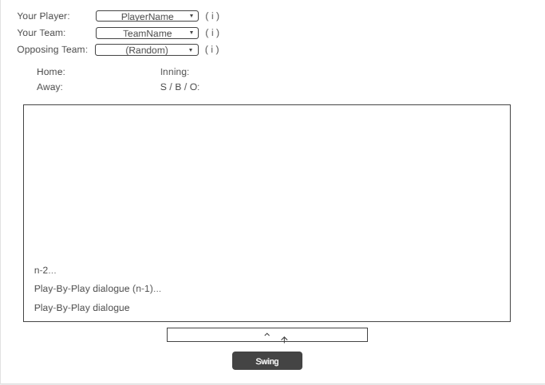

## Unit Deliverable 2 - Final Project GUI ##
- Andrew Ibarra
- Mya B.
- Diego Del Real

This project is a JavaFX-based baseball simulation game that allows users to select a Major League team, view its roster, and simulate a head-to-head game. The program uses an object-oriented design structure with classes such as `Team`, `Player`, and `Game`, along with a GUI built using the Model-View-Controller (MVC) pattern.

The user interface will include:
- A main menu screen for team selection.
- A roster view displaying player statistics.
- A game simulation view that shows scores and results dynamically.
- A results screen summarizing the final box score and announcing the winner.

The goal of this GUI is to make interaction with the baseball simulation intuitive, visually organized, and consistent with JavaFX design principles.

---

## GUI Wireframe

